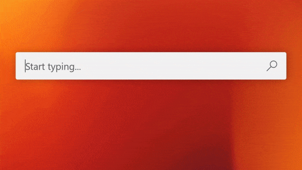

# ChatGPT for PowerToys Run


### Compiling plugin
1. Clone the PowerToys repository to your local disk using the command `git clone https://github.com/microsoft/PowerToys.git`
1. Navigate to the PowerToys directory using `cd PowerToys`
1. Initialize and update submodules with the command `git submodule update --init --recursive`
1. Fork the ChatGPTPowerToys repository on GitHub
1. Clone the fork of ChatGPTPowerToys into the local PowerToys repository by running `git clone https://github.com/ferraridavide/ChatGPTPowerToys.git` in the `PowerToys\src\modules\launcher\Plugins` directory
1. In Visual Studio, add the local clone of ChatGPTPowerToys as an existing project to the PowerToys's Plugins folder (`modules\launcher\Plugins`)
1. Compile

Unfortunately, ChatGPT does not provide a query string parameter for passing prompts. Therefore, we must utilize a browser extension to inject the prompt.

### Using Tampermonkey (recommended)
Tampermonkey is a popular browser extension that allows to inject custom user scripts in webpages, visit [tampermonkey.net](https://www.tampermonkey.net/) to download.

Install this script
```
// ==UserScript==
// @name         PowerToys Run ChatGPT Helper
// @version      0.1
// @description  https://github.com/ferraridavide/ChatGPTPowerToys
// @author       Davide Ferrari
// @match        https://chat.openai.com/chat?PTquery=*
// @icon         https://raw.githubusercontent.com/ferraridavide/ChatGPTPowerToys/master/src/PowerToys.ChatGPT.BrowserExtension/icons/icon128.png
// @grant        none
// ==/UserScript==

(function() {
    'use strict';

    console.log("PowerToys Run ChatGPT Helper script loaded");

    const searchParams = new URLSearchParams(window.location.search);
    const prompt = searchParams.get("PTquery");
    if (prompt) {
        const textArea = document.querySelector("form textarea");
        const submitButton = document.querySelector("form button");

        if (!textArea || !submitButton) {
            console.error("Cannot find required elements");
        }

        textArea.value = prompt;
        setTimeout(() => {
            textArea.value = prompt;
            submitButton.click();
        }, 0);
    }
})();
```

### Using the custom browser extension
1. Open your preferred browser and navigate to the settings or preferences menu.
1. Locate the option for "extensions" or "add-ons" and select it.
1. Enable developer mode in the extensions settings page.
1. In the extensions menu, look for a button or option labeled "Load Unpacked" or "Add Unpacked Extension."
1. Select the folder containing the extension and click "Open."